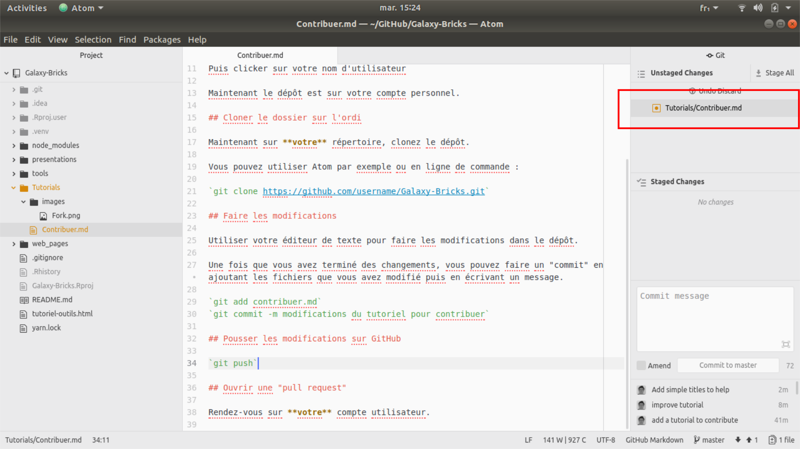
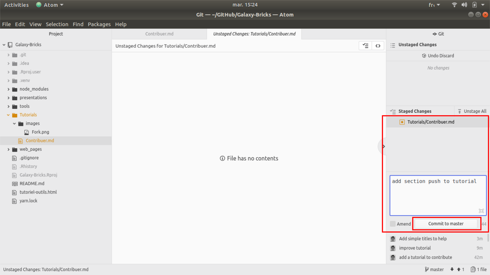
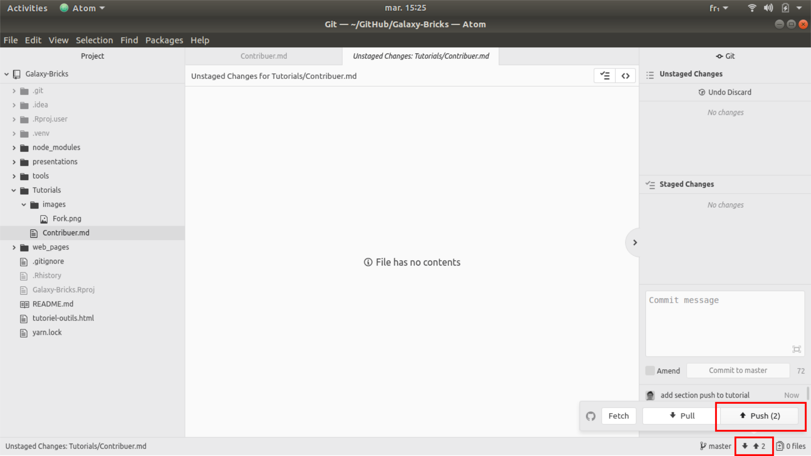

# Comment contribuer à Galaxy-Bricks

Pour contribuer, il vous faut un compte GitHub.

## Créer une branche sur GitHub

Aller sur l'adresse du dépôt 

Clicker sur Fork (dans le coin supérieur droit).

Puis clicker sur votre nom d'utilisateur.

Maintenant le dépôt est sur votre compte personnel.

## Cloner le dossier sur l'ordi

Maintenant sur **votre compte GitHub**, clonez le dépôt.

Vous pouvez utiliser Atom par exemple ou en ligne de commande :

`git clone https://github.com/username/Galaxy-Bricks.git`

## Faire les modifications

Utiliser votre éditeur de texte pour faire les modifications dans le dépôt.

Une fois que vous avez terminé des changements, vous pouvez faire un "commit" en ajoutant les fichiers que vous avez modifié puis en écrivant un message. La méthode pour atom est décrite ci-dessous.

Après avoir enregistré votre ou vos fichier(s), ils s'affichent dans le cadre à droite.  

Double cliquez sur les fichiers que vous voulez envoyer.

Ensuite ajoutez le message et appuyez sur le bouton commit.

Voici l'opération en ligne de commande si vous préférez.

`git add contribuer.md`  
`git commit -m modifications du tutoriel pour contribuer`

## Pousser les modifications sur GitHub

Ensuite appuyez sur les flèches pour envoyer les fichiers sur GitHub. Le petit nombre indique le nombre de commit que vous avez fait.

`git push`

## Ouvrir une "pull request"

Rendez-vous ensuite sur **votre** compte utilisateur. Pour ouvrir une pull request.
